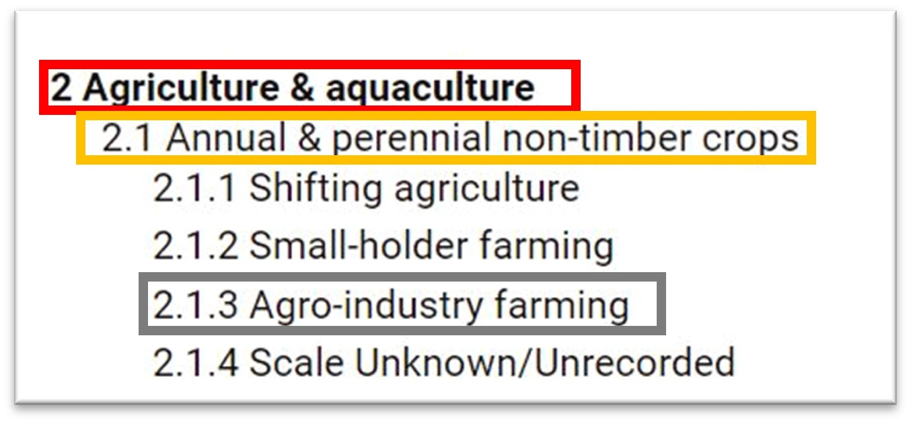
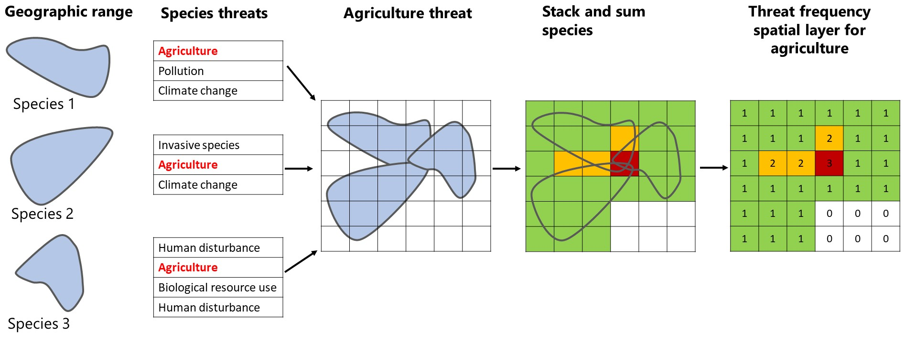

```{r setup, include=FALSE}
knitr::opts_chunk$set(echo = FALSE,
                      message = FALSE,
                      warning = FALSE)
```

```{r }
library(leaflet)
library(gt)
library(tidyverse)
```

# Introduction

The initial idea for this analysis came from a discussion around the EWT's 10 priority areas (EPAs; using this instead of PA which can be confused with the commonly used abbreviation for protected areas). We wanted to know whether there was an understanding about what threats the species of conservation concern (SCC) were facing in each of these EPAs. Some of the broader questions that we hoped to answer include:

-   Which threats should be given the highest weighting and be most critically considered with regard to prioritising conservation action?

-   Are there any specific actions we can take or projects that we can start that address mitigation/prevention of potential threats?

-   Using the spatially explicit outputs, can we identify areas that should be prioritised as potential stewardship sites within the EPAs in order to counter the most prominent threats?

Initially our analysis looked at this from a non-spatially explicit perspective where we calculated the threat frequencies faced by species whose IUCN range intersected with the EPAs. However, it became clear that the outputs following this approach may be of little value based on the fact that a species could contribute the same threat to the overall totals whether it covered 1 or 100% of the range of the EPAs. We therefore decided to change our approach and use the spatial outputs from the modelling work done for the screening tool to provide a spatially explicit quantification of threat frequencies. The analysis was broadened to cover the whole of South Africa given that our models were developed at a national scale. The results presented here are limited to the EPAs but are available for the entire country.

Our approach comprised of the following steps:

1.  Compile a list of CR, EN, and VU species from five taxonomic groups including amphibian, bird, butterfly, mammal, and reptile species for which we had occurrence data and/or spatial layers from species distribution models.

2.  For each species on the list, compile information from their IUCN assessments to identify major threats (Level 1), sub-threats (Level 2), and detail of threats (Level 3).

3.  Join these threat data to the spatial distribution of each species and create a raster layer at a 1 x 1km resolution which summed the number of species for each threat individually that occurred within a cell/pixel.

4.  Map these layers on a national scale and overlay the EPAs in order to identify threat hotspots within the EPAs.

Detail on these steps and how to interpret the results are provided below.

# Methods

## IUCN threat data

Threat categories assigned to each species were designated according to the standardised IUCN Threat Classification theme (available [here](https://www.iucnredlist.org/resources/threat-classification-scheme)). Threats were broken down into "Level One Threats" (major threats; red), "Level Two Threats" (sub-threats; orange) and "Level Three Threats" (aka detail; grey) - see the figure below. Note that not all threats in the IUCN Threat Classification include the "detail" level. We also aimed to assign an impact score and threat ranking to each species in order to try quantify which threats were having the largest impact on each species. This gave us the option to objectively remove certain listed threats deemed less important from the analysis if needed.

{width="859"}

Each taxonomic group had its threats assigned and ranked in the following way:

**Amphibians**: All species threat data were extracted from the species accounts on the IUCN website and their threats ranked according the threat "Impact Score" which considers the scope, timing, and severity of the threat. Where two threats had the same impact score, they were ranked together, thus it is possible that some species have multiple #1 ranked threats.

**Birds**: Threat data for bird species were taken from BirdLife-SA's 2016 Regional Red List Report. For each species, experts listed the threats faced according to the IUCN threat classification scheme. Furthermore, each threat was given a rating on a scale of 1 to 3 by BirdLife-SA. With 3 being the most severe and 1 least severe recognized threat. We collated this data and ranked the threats in order of severity. Where two threats had the same rating according to the Birdlife-SA master-sheet, they were ranked together, thus it is possible that some species have multiple #1 ranked threats.

**Butterflies**: All species threat data were extracted from the species accounts on the IUCN website and their threats ranked according the threat "Impact Score" which considers the scope, timing, and severity of the threat. Where two threats had the same impact score, they were ranked together, thus it is possible that some species have multiple #1 ranked threats for example.

**Mammals**: Each mammal species had a table of IUCN-listed threats, including the threat ranking, extracted from the 2016 Red List of Mammals of South Africa. This was incorporated into our database as is.

**Reptiles:**All species threat data were extracted from the species accounts on the IUCN website had their threats ranked according the threat "Impact Score" which considers the scope, timing, and severity of the threat. Where two threats had the same impact score, they were ranked together, thus it is possible that some species have multiple #1 ranked threats for example. For species not found on the IUCN website, we consulted the 2014 Atlas and Red List of the Reptiles of South Africa, Lesotho, and Swaziland. Species accounts here contain a description of threats and these were carefully analysed and converted to the IUCN threat classification and, where possible, ranked taking into account their scope, timing, and severity. This same approach was applied to species not endemic to South Africa (e.g., Nile Crocodile), as the threats listed on the IUCN website were not specific to the South African population.

## Spatial processing

We created a spatial raster layer for each Level 1 and Level 2 threat. For each threat layer we followed the process outlined below. In short, we selected all species that had the focal threat listed in their assessments and then overlaid the geographic distribution (derived primarily from species distribution models) of those species onto the map of South Africa. We then created a raster grid of 1 x 1km and superimposed that onto the species layers. For each pixel of the raster layer we summed the total number of stacked species, which then represented the final threat frequency raster layer. Note that species have multiple threats and are therefore represented across threat categories.

```{r}


```

# Maps

**A note on interpretation of the maps using the Level 1 agriculture layer.** The maps highlight areas in which species that are threatened by agriculture are concentrated. These areas are not under going transformation of natural habitat to agriculture per se, but if there was expanded development related to agriculture in these areas, the development would potentially impact the number of species in the corresponding pixels that occur within the development footprint.

## All threats

Frequency of all threats across all Level 1 threat categories, with the protected areas (PAs) database included as a layer.

```{r, out.width="100%", out.height=630}
map1 <- readRDS("Output/Mapping/EPA/All_threats.rds")
map1
```

## Threat hotspots

Hotspots of all threats presented above. A simple threshold was applied to the frequency data where every pixel in red has \> 100 threats.

```{r, out.width="100%", out.height=630}
map2 <- readRDS("Output/Mapping/EPA/Hotspots.rds")
map2
```

## Threat layers - part 1

Threat frequency layers of the 3 most prevalent Level 1 threats in descending order (AGR = Agriculture & aquaculture; BIO = Biological resource use; NAT = Natural system modifications)

```{r, out.width="100%", out.height=630}
map3 <- readRDS("Output/Mapping/EPA/Lev1_high.rds")
map3
```

## Threat layers - part 2

Threat frequency layers of the 3 next most prevalent Level 1 threats in descending order (RES = Residential & commercial development; ENE = Energy production & mining; POL = Pollution). Note the change in absolute frequency from map above.

```{r, out.width="100%", out.height=630}
map4 <- readRDS("Output/Mapping/EPA/Lev1_low.rds")
map4
```

## Agriculture sub-threat layers

Threat frequency layers of the Level 2 sub-threats within the Agriculture and Aquaculture Level 1 threat in descending order (NTC = Annual & perennial non-timber crops ; WPP = Wood & pulp plantations; LFR = Livestock farming & ranching ).

```{r, out.width="100%", out.height=630}
map5 <- readRDS("Output/Mapping/EPA/Lev2_AGR.rds")
map5
```

# Species summaries

Overall 208 species were included in the national analysis with the following breakdown:

```{r}

class_table <- read_csv("Output/Mapping/tables & lists/class_tally.csv")
gt(class_table) %>% 
  cols_label(class = "Class", n = "Total species")


```

The frequency of listed threats for species within each taxonomic group are shown in the figure below.

```{r}
knitr::include_graphics("Output/Mapping/tables & lists/threat_breakdown.jpg")
```

The number of species within each taxonomic group that have a corresponding threat listed in their IUCN assessment are shown below.

```{r}
knitr::include_graphics("Output/Mapping/tables & lists/species_breakdown.jpg")
```

# Findings (preliminary)

-   Agriculture is clearly the most prominent threat to our set of SCC

-   There are several hotspot areas that have no formal protection especially in southern parts of the Highveld grasslands, southern parts of Eastern Free State grasslands, and the north west parts of KZN grasslands.

-   Thankfully there seems to be good protection of hotspots in Zululand and to a lesser extent in the Montane grasslands.

# Analysis considerations

-   Should we filter the data to include only the most important threats via our ranking system? Or is it justifiable to include all threats?

-   Do we need present results for other sub-threats for the next ranked Level 1 threats after agriculture such as Biological Resource Use or Natural Systems Modification?

-   Do we need to change the threshold for the hotspot areas?

-   It is necessary to know which species occur in the hotspot areas? Note that doing this is not an easy task from a computational perspective.

# Appendices

## Level 1 threat codes

```{r}

lev1 <- read_csv("Input/Threat_Codes_L1.csv")
gt(lev1) %>% 
  tab_header(
    title = "Level 1 threats"
    ) %>% 
  cols_label(level1_name = "Name", level1_code  = "Code")


```

## Level 2 threat codes

```{r}

lev2 <- read_csv("Input/Threat_Codes_L2.csv")
gt(lev2) %>% 
  tab_header(
    title = "Level 2 threats"
    ) %>% 
  cols_label(level2_name = "Name", level2_code  = "Code")


```

## Species list

```{r}
spp <- read_csv("Output/Mapping/tables & lists/species_list.csv")
gt(spp) %>% 
  tab_header(
    title = "Species included in analysis of threat frequencies"
    ) %>% 
  cols_label(class = "Class", 
             scientific_name  = "Scientific name", 
             n = "Number of unique threats") %>% 
  tab_style(style = cell_text(style = "italic"),
            locations = cells_body(
              columns = scientific_name
              )
            )
```

```{r}
# occ_data <- read_csv(glue("{file_dir}/occurrence_clean_{sppselect}.csv"))
# 
# # https://rstudio.github.io/DT/options.html
# 
# DT::datatable(occ_data, class = 'cell-border stripe', 
#               extensions = 'Buttons',
#               options = list(dom = 'Bfrtip', scrollX = '300px', pageLength = 5, 
#                              buttons = c('copy', 'csv', 'excel')))

```
